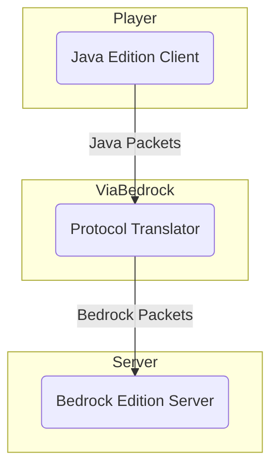

# ViaBedrock
ViaVersion addon to add support for Minecraft: Bedrock Edition servers.

ViaBedrock aims to be as compatible and accurate as possible with the Minecraft: Bedrock Edition protocol.

## Usage
**ViaBedrock is in very early stages of development and NOT intended for regular use yet.**

If you want to try it out anyway you can download the latest [ViaProxy dev build](https://build.lenni0451.net/job/ViaProxy/) (Click on the **ViaProxy-x.x.x.jar** file).

**Do not report any bugs yet. There are still a lot of things which are not implemented yet.**

If you want to talk about ViaBedrock or learn more about it you can join my [Discord](https://discord.gg/dCzT9XHEWu).

## Features
- [x] Pinging
- [x] Joining
- [x] Xbox Live Auth
- [x] Chat / Commands
- [x] Chunks (Including all formats)
- [x] Chunk caching
- [x] Block updates
- [x] Block entities
- [x] Biomes
- [x] Player spawning
- [x] Entity spawning
- [x] Entity interactions
- [ ] Entity metadata
- [x] Entity attributes
- [ ] Entity mounting
- [x] Player abilities
- [x] Movement
- [ ] Client-Authoritative Inventory
- [ ] Server-Authoritative Inventory
- [ ] Item data
- [ ] Block breaking
- [ ] Block placing
- [x] Respawning and dimension switching
- [x] Form GUIs
- [x] Scoreboard
- [x] Titles
- [x] Bossbar
- [x] Player list
- [x] Command suggestions
- [x] Sounds (No mob sounds yet)
- [x] Particles
- [x] Basic resource pack conversion (Contributions are welcome)

## How it works

We've made a small diagram to show where ViaBedrock sits and what it does.
ViaBedrock may either be installed by a player on their Java client to join Bedrock server
or by a Bedrock server owner to let Java users join their Bedrock server.

## Optional clientside mods
Below is a list of mods which can be used in combination with ViaBedrock to enhance certain aspects, which would not be possible without client modification:
- [ViaBedrockUtility](https://github.com/Oryxel/ViaBedrockUtility): Adds support for some custom player skins and improves custom entity rendering
- [BedrockSkinUtility](https://github.com/Camotoy/BedrockSkinUtility): Adds support for some custom player skins

## Useful resources
ViaBedrock would not have been possible without the following projects:
- [ViaVersion](https://github.com/ViaVersion/ViaVersion): Provides the base for translating packets
- [CloudburstMC Protocol](https://github.com/CloudburstMC/Protocol): Documentation of the Bedrock Edition protocol
- [PMMP BedrockProtocol](https://github.com/pmmp/BedrockProtocol): Documentation of the Bedrock Edition protocol
- [Mojang Protocol Docs](https://github.com/Mojang/bedrock-protocol-docs): Documentation of the Bedrock Edition protocol
- [CloudburstMC Protocol Docs](https://github.com/CloudburstMC/protocol-docs): Documentation of the Bedrock Edition protocol
- [wiki.vg](https://minecraft.wiki/w/Minecraft_Wiki:Projects/wiki.vg_merge/Bedrock_Protocol): Documentation of the Bedrock Edition protocol
- [mcrputil](https://github.com/valaphee/mcrputil): Documentation of Bedrock Edition resource pack encryption
- [wiki.bedrock.dev](https://wiki.bedrock.dev): Documentation of various technical aspects of Bedrock Edition

Additionally ViaBedrock uses assets and data dumps from other projects: See the `Data Asset Sources.md` file for more information.
